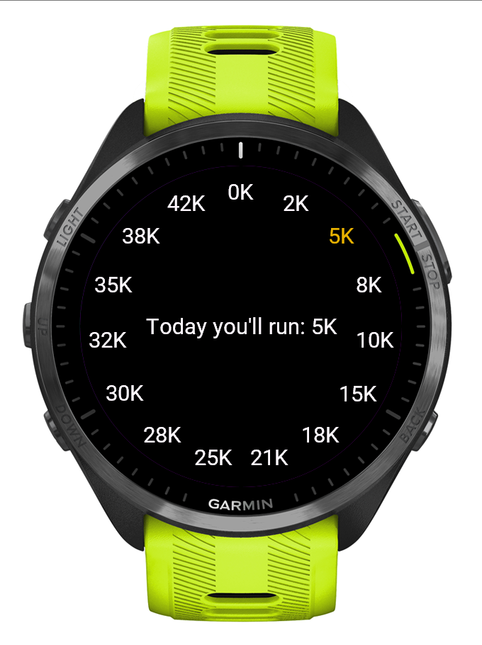

# Roulette Runner App

The **Roulette Runner** app is a simple Garmin app developed using MonkeyC. It allows the user to pick a random number from a roulette wheel, which can be used to determine distances to run, minutes to train, or other fitness-related values.

## Screenshots

Here are some screenshots of the app in action:

## Features

- **Random Number Generation**: The app displays a random number from the roulette wheel each time a button is pressed.
- **Customizable Use**: Users can adapt the generated number for different fitness purposes (e.g., distance to run, time to train).
- **Interactive Interface**: The app allows users to interact by pressing buttons to cycle through the roulette numbers.

## App Workflow

1. **Press the button** to increment the current number in the roulette list.
2. **Press the other button** to decrement the current number.
3. The **number will be displayed** on the screen at a random position around the circle.
4. Users can customize the meaning of the number (e.g., translating it to distance, time, etc.).

## Compatibility

The **Roulette** app is currently designed for the **Garmin Forerunner 965**. Compatibility with other Garmin devices has not been tested yet.

## Setup & Installation

To use this app on a Garmin device, follow these steps:

1. **Install Garmin Connect**:
   - Download and install Garmin Connect from [Garmin's official website](https://www.garmin.com/).

2. **Install MonkeyC SDK**:
   - Download the [MonkeyC SDK](https://developer.garmin.com/downloads/) to set up your development environment.

3. **Import the project** into your MonkeyC environment.

4. **Build the app**:
   - Run the build command using the MonkeyC SDK to compile the project and deploy it to your Garmin device.

5. **Launch the App**:
   - Once installed, launch the **Roulette** app on your Garmin device and start pressing buttons to cycle through the numbers.

## Customization

- You can modify the roulette numbers or logic based on your fitness goals. The app currently uses the standard roulette numbers (0, 1-36), but you can change the list to suit your needs.
- The number shown can be mapped to various fitness metrics such as minutes, kilometers, or repetitions.

## Dependencies

- **MonkeyC SDK**: The app is built using the MonkeyC SDK for Garmin devices.
- **Garmin Device**: This app requires a Garmin device that supports the MonkeyC framework.

## License

This project is licensed under the MIT License - see the [LICENSE](LICENSE) file for details.
